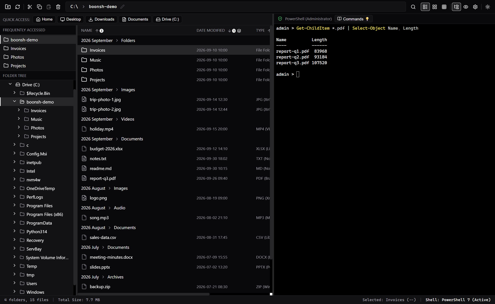
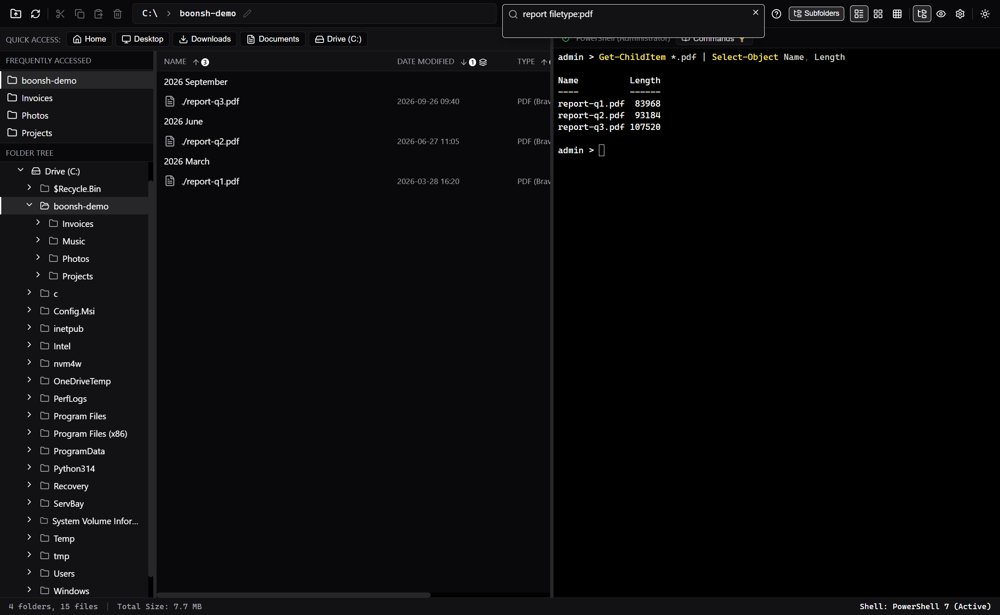
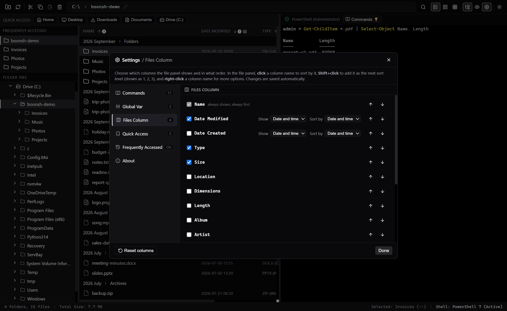

# boonsh

**A free file manager for Windows with a PowerShell terminal built in.**
Browse your folders on the left, type commands on the right, and the two stay in sync: open a folder and the terminal moves there; `cd` in the terminal and the file panel follows.



- **Sort and group your way:** sort by several columns at once, and group the list by month, year, file type, size and more, with one line per group such as `2026 September > Images`.
- **A search box that understands folders:** find files by name, size, type, date, or by the folders they sit in (`path:invoices +2026`), and search only the places you choose (`input:.\clients, d:\work`).
- **Your own shortcuts for the terminal:** pick files in the panel, and fill them into commands with `{SELEC}` and `{DEST}`.
- **More:** bulk rename with undo, ZIP and extract, Quick Access and Frequently Accessed folders, a preview drawer, dark and light themes.

boonsh is free software under the [MIT License](LICENSE).

---

## Download

Go to the **[latest release](https://github.com/ssaelao-wq/boonsh/releases/latest)** and download **one** of these files:

| File | Choose it when | Installs for | Needs administrator rights |
| --- | --- | --- | --- |
| **`boonsh_x.y.z_x64-setup.exe`** | **Recommended.** The normal way to install. | Only you | No |
| **`boonsh_x.y.z_x64_en-US.msi`** | You prefer an MSI package, or you want boonsh for every user of the PC, or you deploy it with a tool. | Everyone on the PC | Yes (Windows asks for permission) |

(`x.y.z` is the version number, for example `0.8.1`.) Install **only one** of the two.

**Requirements:** Windows 10 or Windows 11, 64-bit. boonsh uses the Microsoft Edge **WebView2 Runtime**, which is already part of Windows 11 and of up-to-date Windows 10. If your PC does not have it, both installers download and install it for you (you need an internet connection for that step).

### The "Windows protected your PC" message

The installers are not code-signed (a signing certificate costs money), so Windows SmartScreen may show a blue window the first time. This is normal for free apps:

1. Click **More info**.
2. Click **Run anyway**.

You can check the download first: right-click the file, **Properties**, and look at its size; or build boonsh yourself from this source (see [Build from source](#build-from-source)).

---

## Install with the setup .exe (recommended)

1. Download **`boonsh_x.y.z_x64-setup.exe`** from the [latest release](https://github.com/ssaelao-wq/boonsh/releases/latest).
2. Double-click it. If SmartScreen appears, click **More info**, then **Run anyway**.
3. **Welcome:** click **Next**.
4. **License:** read the MIT License and click **I Agree**.
5. **Install location:** the default is `C:\Users\<you>\AppData\Local\boonsh`. You do not need administrator rights. Click **Next** (change the folder first if you like).
6. Wait while the files are copied, then click **Next** if the installer asks.
7. **Finish page:** leave **Run boonsh** ticked to start it now, and tick **Create desktop shortcut** if you want an icon on the desktop. Click **Finish**.

A **Start Menu** entry named *boonsh* is always created.

*Silent install (optional):* run `boonsh_x.y.z_x64-setup.exe /S` from a command prompt (this also creates the desktop shortcut). Add `/D=C:\Some\Folder` as the last argument to choose the install folder.

## Install with the .msi

1. Download **`boonsh_x.y.z_x64_en-US.msi`** from the [latest release](https://github.com/ssaelao-wq/boonsh/releases/latest).
2. Double-click it. If SmartScreen appears, click **More info**, then **Run anyway**.
3. **Welcome:** click **Next**.
4. **License:** tick **I accept the terms in the License Agreement** and click **Next**.
5. **Install folder:** the default is `C:\Program Files\boonsh`. Click **Next** (or **Change...** to pick another folder).
6. Click **Install**. Windows asks for administrator permission: click **Yes**.
7. On the last page leave **Launch boonsh** ticked if you want to start it, and click **Finish**.

*Shortcuts:* the MSI adds *boonsh* to the **Start Menu** and puts a shortcut on the **Desktop**.

*Silent install (optional):* `msiexec /i boonsh_x.y.z_x64_en-US.msi /qn` (run it from an administrator prompt).

### If you already have the other kind installed

The setup .exe notices an existing MSI installation and offers to remove it first; accept that, then continue. To go the other way (MSI over a setup.exe install), uninstall boonsh in *Settings > Apps* first.

---

## Updating

Download the newer installer and run it, the same kind you used before. It replaces the old version, and **your settings and lists are kept**.

## Uninstalling

Open **Settings > Apps > Installed apps** (Windows 10: *Apps & features*), find **boonsh**, and choose **Uninstall**.

- The **setup .exe** uninstaller has a tick box, **Delete the application data**. Leave it unticked to keep your boonsh settings for a later reinstall; tick it to remove them too.
- Your settings (theme, Quick Access, saved commands, columns, ...) are stored in `%LOCALAPPDATA%\com.boonsh.app`. You can delete that folder by hand to start fresh. Your own files and folders are never touched.

---

## First steps

boonsh opens in your **Downloads** folder. To open it in a folder of your choice, start it as `boonsh.exe "D:\some folder"`.

- **Double-click** a folder to open it. The terminal on the right moves to the same folder, and the other way round.
- **Right-click** almost anything: files, folders, the empty space, and the **column headers** (sort and group options).
- **Click a column name** to sort; **Shift+click** another column name to add a second sort level (numbers 1, 2, 3 show the order).
- **Group the list:** right-click a column name, **Group by**. Click the `>` in a group line to fold that group.
- **Search:** click the magnifier. Try `report filetype:pdf`, `path:invoices +2026`, or `filedate:7d`. Click the **?** button for all options.
- **Settings (the gear):** your terminal command list, global variables, which columns to show, Quick Access, Frequently Accessed and *About*.
- **Terminal:** it is a real PowerShell (PowerShell 7 if you have it, otherwise Windows PowerShell, otherwise `cmd`). The **Commands** button lists handy commands you can edit.

The complete manual, with every feature explained, is in **[FEATURES_SPEC.md](FEATURES_SPEC.md)**.

### More screenshots

| Search | Settings |
| --- | --- |
|  |  |

---

## Troubleshooting

| Problem | What to do |
| --- | --- |
| Windows says "Windows protected your PC" | Click **More info**, then **Run anyway** (see above). |
| The window stays blank or the installer cannot get WebView2 | boonsh needs the *Microsoft Edge WebView2 Runtime*. Install it from Microsoft (search for "WebView2 Runtime"), then start boonsh again. |
| The installer says another version is installed | Uninstall the old one from *Settings > Apps*, or run the newer installer of the same kind. |
| The extra columns (Length, Artist, ...) are empty | They come from the file's own properties, as in Windows Explorer. Files without that information show an empty cell. |
| The terminal shows `admin >` | boonsh is running as administrator. The button at the top right of the terminal switches between normal and administrator mode. |

Something else? Please [open an issue](https://github.com/ssaelao-wq/boonsh/issues) and say which version you have (Settings > About).

---

## Build from source

You need Windows 10/11, [Node.js](https://nodejs.org/) (LTS), [Rust](https://rustup.rs/) (stable, MSVC toolchain) and the Visual Studio C++ Build Tools. Then, in this folder:

```
npm install
npm run tauri dev      # run the app in development mode
npm run tauri build    # build the installers (src-tauri\target\release\bundle)
cargo test --manifest-path src-tauri/Cargo.toml --lib   # run the Rust tests
```

boonsh is built with [Tauri](https://tauri.app/) 2, React 19, TypeScript and Rust. Notes for developers are in [CLAUDE.md](CLAUDE.md), the history of changes in [RELEASE.md](RELEASE.md).

## License

boonsh is released under the **MIT License**: you may use, copy, change and share it for free. Copyright (c) 2026 Somboon L. See [LICENSE](LICENSE).

The libraries inside boonsh keep their own licenses, listed with their full texts in [`src-tauri/THIRD_PARTY_LICENSES.txt`](src-tauri/THIRD_PARTY_LICENSES.txt) (the installer also puts this file next to the app).
